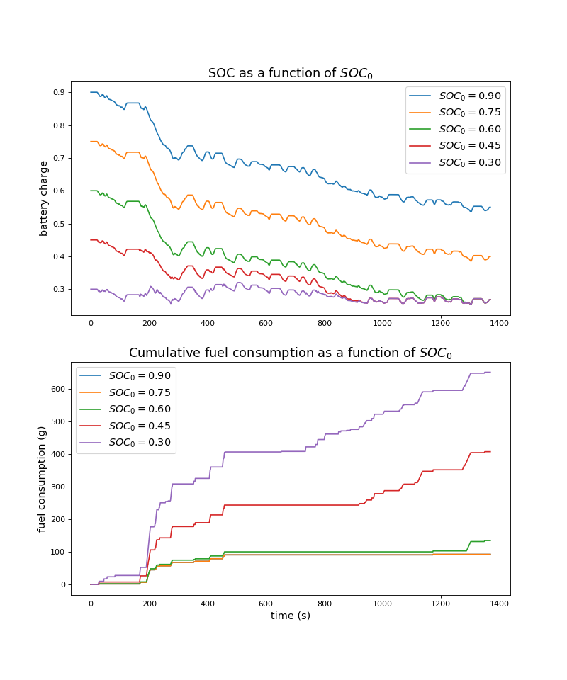

# Optimizing PHEV battery use using dynamic programming
This project utilizes dynamic programming with application to energy management in plug-in hybrid electric vehicles (PHEVs). The purpose of this is to build a "cycle beater" that will optimize for the Urban Dynamic Driving Schedule (UDDS) power demand. In other words, the "cycle beater" will optimially discharge the electric battery to minimize fuel consumption and maximize the vehicles's miles-per-gallon. Since UDDS is used for vehicle emissions testing by the EPA, it is illegal for car manufacturers to use such a technique to schedule battery use. That being said, manufacturers have been caught doing so. This was completed as part of a class project in my MS program. Thanks to Prof. Scott Moura for providing UDDS data and overall framework on this. 

## Key questions explored
- When is it optimal to use the battery instead of gasoline?
- How does the battery's initial state of charge (SOC) affect cumulative fuel consumption and final SOC?

## Techniques used
- dynamic programming
- control systems

## Key findings
- As I decrease the initial SOC, total fuel consumption increases. This makes sense because we have less energy stored in the battery and thus have to rely more on our engine to meet the power demand. Also, a lower initial SOC means that I have to charge our battery more throughout the ride. Charging the battery means that I have to utilize our engine to meet demand.
- The results also show that the initial and final SOC are linked. The higher the initial SOC, the higher the final SOC. Batteries that have an initial SOC under 0.60 have the same final SOC (0.268), which is near the minimum possible level. This makes sense because the batteries can “freely” utilize its stored energy without exceeding the maximum allowable battery power. In the case where initial SOC is higher (e.g. 0.9), battery power appears to be more constrained by its upper bound, $P_{batt, max}$. 
- Interestingly, final SOC and total fuel consumption for starting SOC of 0.9 and 0.75 are nearly identical.

